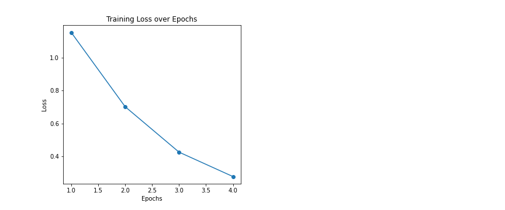
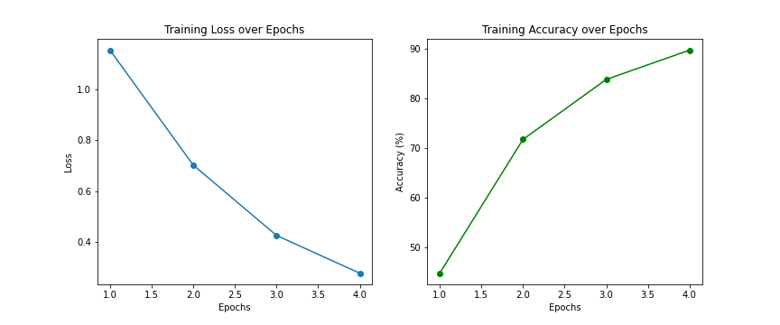
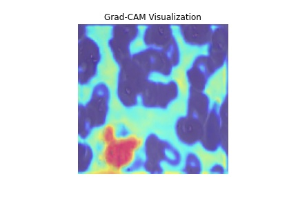

# Author: Anvesha Porwal
# Project: AI-enabled cell image classifier


## Project outline
This project develops a deep learning model that classifies different types of blood cells from microscopic images using GPU acceleration (CUDA or MPS). Additionally, interpret the model's predictions using Grad-CAM.

## Packages
- Python
- PyTorch (with CUDA or MPS)
- Matplotlib / Seaborn (for visualization)
- OpenCV
- Scikit-learn

## Dataset
- [Blood Cell Images Dataset](https://www.kaggle.com/paultimothymooney/blood-cells)

### Training Graphs 



### Grad-CAM Visualization


## Quick Start
1. Install dependencies:
```bash
pip install -r requirements.txt
```
2. Run the notebooks in order:
   - `1_data_preprocessing.ipynb`
   - `2_train_model.ipynb`
   - `3_gradcam_visualization.ipynb`

## Hardware Compatibility
This project automatically detects the best available device:
- **CUDA** (NVIDIA GPUs)
- **MPS** (Apple M1/M2/M3 Silicon GPUs)
- **CPU** fallback
